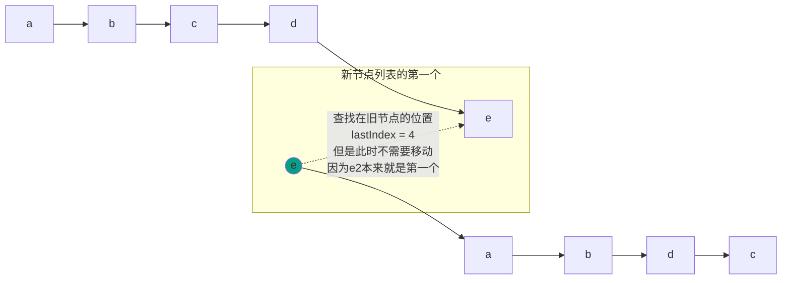

```mermaid
flowchart LR
a1[a] --> b1[b] --> c1[c] --> d1[d] --> e1[e]
e2((e)):::someclass --> a2[a] --> b2[b] --> d2[d] --> c2[c]
subgraph 新节点列表的第一个
e2 -.查找在旧节点的位置<br>lastIndex = 4<br>但是此时不需要移动<br>因为e2本来就是第一个.-> e1
end
classDef someclass fill: #089e8a
```