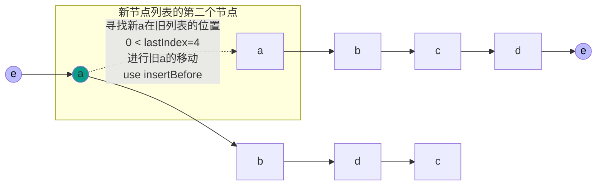

```mermaid
flowchart LR
a1[a] --> b1[b] --> c1[c] --> d1[d] --> e1((e)):::complete
e2((e)):::complete --> a2((a)):::doing --> b2[b] --> d2[d] --> c2[c]
subgraph 新节点列表的第二个节点
a2 -.寻找新a在旧列表的位置<br>0 < lastIndex=4<br>进行旧a的移动<br>use insertBefore.-> a1
end

classDef doing fill: #089e8a
classDef complete fill: #bbf,color: #000
```